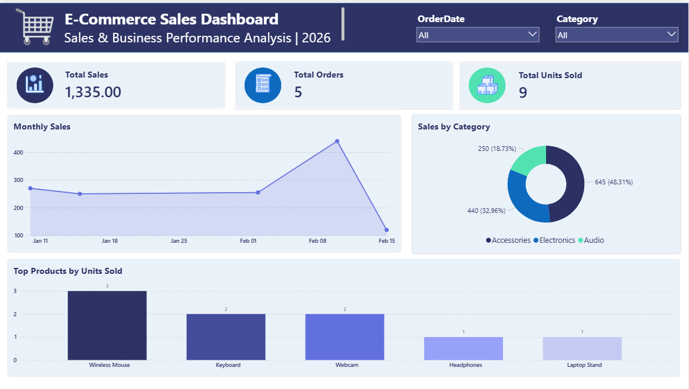

# E-Commerce Sales Analysis

An e-commerce sales analysis project using SQL Server and Power BI.

## Tools
- SQL Server
- Power BI
- DAX

## Project Analysis
- Total Sales
- Total Orders
- Total Units Sold
- Sales by Category
- Monthly Sales
- Top Products by Units Sold

## Project Structure

- SQL: Database creation, data insertion, and SQL queries
- PowerBI: Interactive sales dashboard

## Dashboard

The Power BI dashboard provides an overview of sales performance, order activity, product performance, and sales trends.

## Dashboard

  

